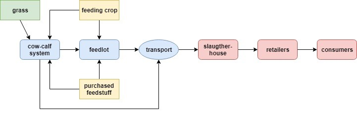
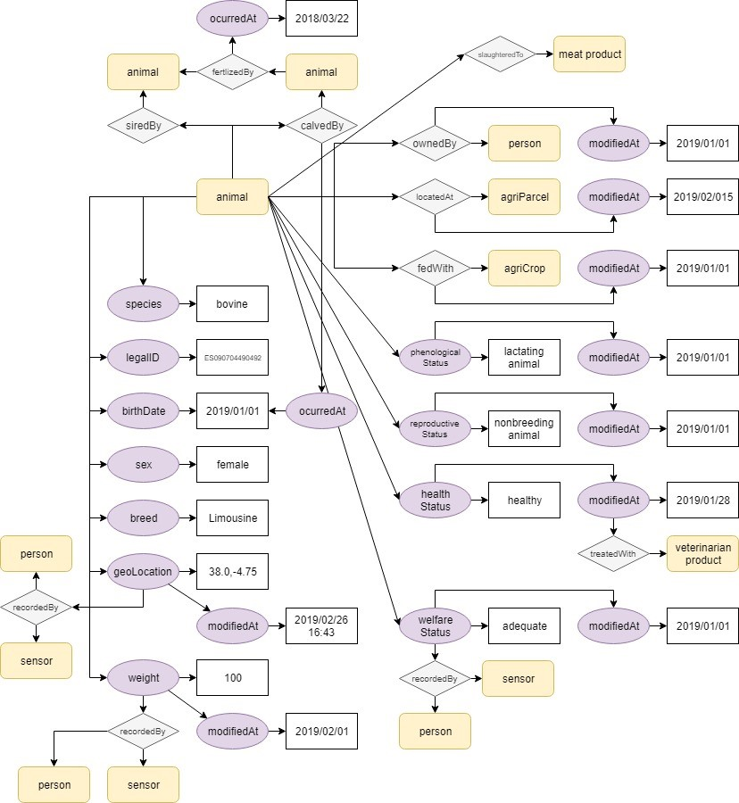

# Animal data model: ShareBeef

## Introduction

The next diagram describes the beef chain considered in the ShareBeef project.
In this diagram different stakeholders of the meat chain are described like some
of their interactions.



During the execution of the project it will be necessary to define several
entities to handle the information generated in the proposed solution. Within
all these entities, the animal entity that is the center of the solution stands
out in the first place

## Animal data model

### Model definition

The proposed animal data model has been made from a more general point of view,
trying to adjust it to the information coming from the devices and sensors used
in the UC.

The proposed model for the animal entity has the following properties:

-   id: unique identifier
-   type: Entity type. It must be equal to “Animal”
-   species: Species to which the animal belongs
    -   Attribute type: Property. [Text](https://schema.org/Text)
    -   Allowed values: (dairy cattle, beef cattle, sheep, goat, horse, pig)
    -   Mandatory
-   relatedSource: ID of the animal in external applications
    -   Attribute type: List of StructuredValue
    -   Values:
        -   application: ID of the particular AgriApp entity
            -   Type: URI
        -   applicationEntityId: ID of the animal in the external application
            -   Type: Text
    -   Optional
-   legalID: Legal ID of the animal:
    -   Attribute type: Property. [Text](https://schema.org/Text)
    -   Mandatory
-   birthdate: Animal’s birthdate
    -   Attribute type: Property. [DateTime](https://schema.org/DateTime)
    -   Mandatory
-   sex: Sex of the animal
    -   Attribute type: Property. [Text](https://schema.org/Text)
    -   Allowed values: (female, male)
    -   Mandatory
-   breed: Breed of the animal
    -   Attribute type: Property. [Text](https://schema.org/Text)
    -   Optional
-   calvedBy: Mother of the animal
    -   Attribute type: Relationship
    -   Optional
-   siredBy: Father of the animal
    -   Attribute type: Relationship
    -   Optional
-   location: Location of the animal represented by a GeoJSON geometry.
    -   Attribute type: GeoProperty. `geo:json`.
    -   Normative References:
        [https://tools.ietf.org/html/rfc7946](https://tools.ietf.org/html/rfc7946)
    -   Attribute metadata:
        -   timestamp: optional timestamp for the observed value.
            -   Type: DateTime
    -   Optional
-   weight: The weight of the animal as a number
    -   Attribute type: Number
    -   Default unit: kg
    -   Attribute metadata:
        -   timestamp: optional timestamp for the observed value.
            -   Type: DateTime
    -   Optional
-   ownedBy: The owner of the animal:
    -   Attribute type: Relationship
    -   Attribute metadata:
        -   timestamp: optional timestamp for the observed value.
            -   Type: DateTime
    -   Optional
-   locatedAt: AgriParcel relationship:
    -   Attribute type: Relationship
    -   Attribute metadata:
        -   timestamp: optional timestamp for the observed value.
            -   Type: DateTime
    -   Optional
-   phenologicalCondition: Phenological condition of the animal
    -   Attribute type: Property. [Text](https://schema.org/Text)
    -   Attribute metadata:
        -   timestamp: optional timestamp for the observed value.
            -   Type: DateTime
    -   Optional
-   reproductiveCondition: Reproductive condition of the animal
    -   Attribute type: Property. [Text](https://schema.org/Text)
    -   Attribute metadata:
        -   timestamp: optional timestamp for the observed value.
            -   Type: DateTime
    -   Optional
-   healthCondition: Health condition of the animal
    -   Attribute type: Property. [Text](https://schema.org/Text)
    -   Attribute metadata:
        -   timestamp: optional timestamp for the observed value.
            -   Type: DateTime
    -   Optional
-   fedWith: Food used for the animal
    -   Attribute type: Relationship
    -   Attribute metadata:
        -   timestamp: optional timestamp for the observed value.
        -   Type: DateTime
    -   Optional
-   welfareCondition: Indicator of the animal welfare
    -   Attribute type: Property. [Text](https://schema.org/Text)
    -   Attribute metadata:
        -   timestamp: optional timestamp for the observed value.
            -   Type: DateTime
    -   Optional

### Example

Below a JSON example of the animal data model is shown:

```json
{
    "id": "urn:ngsi-ld:Animal:ca3f1295-500c-4aa3-b745-d143097d5c01",
    "type": "Animal",
    "species": {
        "value": "sheep"
    },
    "legalID": {
        "value": "ES142589652140"
    },
    "birthdate": {
        "type": "DateTime",
        "value": "2016-11-30T07:00:00.00Z"
    },
    "sex": {
        "value": "female"
    },
    "breed": {
        "value": "Meriana"
    },
    "calvedBy": {
        "type": "Relationship",
        "value": "urn:ngsi-ld:Animal:aa9f1295-425c-8ba3-b745-b653097d5a87"
    },
    "siredBy": {
        "type": "Relationship",
        "value": "urn:ngsi-ld:Animal:aa9f1295-425c-8ba3-b745-b653041d5a87"
    },
    "location": {
        "type": "geo:json",
        "value": {
            "type": "Point",
            "coordinates": [-4.754444444, 41.640833333]
        },
        "metadata": {
            "timestamp": {
                "type": "DateTime",
                "value": "2019-02-28T09:23:00.00Z"
            }
        }
    },
    "weight": {
        "value": 65.63,
        "metadata": {
            "timestamp": {
                "type": "DateTime",
                "value": "2019-02-21T09:23:14.00Z"
            }
        }
    },
    "ownedBy": {
        "type": "Relationship",
        "value": "http://person.org/leon",
        "metadata": {
            "timestamp": {
                "type": "DateTime",
                "value": "2019-01-14T14:23:14.00Z"
            }
        }
    },
    "locatedAt": {
        "type": "Relationship",
        "value": "urn:ngsi-ld:AgriParcel:1ea0f120-4474-11e8-9919-672036642081",
        "metadata": {
            "timestamp": {
                "type": "DateTime",
                "value": "2019-03-22T18:23:31.00Z"
            }
        }
    },
    "phenologicalCondition": {
        "value": "adult",
        "metadata": {
            "timestamp": {
                "type": "DateTime",
                "value": "2019-03-22T18:23:31.00Z"
            }
        }
    },
    "reproductiveCondition": {
        "value": "inCalf",
        "metadata": {
            "timestamp": {
                "type": "DateTime",
                "value": "2018-02-22T18:23:31.00Z"
            }
        }
    },
    "healthCondition": {
        "value": "healthy",
        "metadata": {
            "timestamp": {
                "type": "DateTime",
                "value": "2018-12-22T18:23:31.00Z"
            }
        }
    },
    "fedWith": {
        "type": "Relationship",
        "value": "urn:ngsi-ld:FEED:1ea0f120-4474-11e8-9919-0000000081",
        "metadata": {
            "timestamp": {
                "type": "DateTime",
                "value": "2019-03-20T17:41:31.00Z"
            }
        }
    },
    "welfareCondition": {
        "value": "adequate",
        "metadata": {
            "timestamp": {
                "type": "DateTime",
                "value": "2018-12-22T18:23:31.00Z"
            }
        }
    }
}
```

### Diagram


